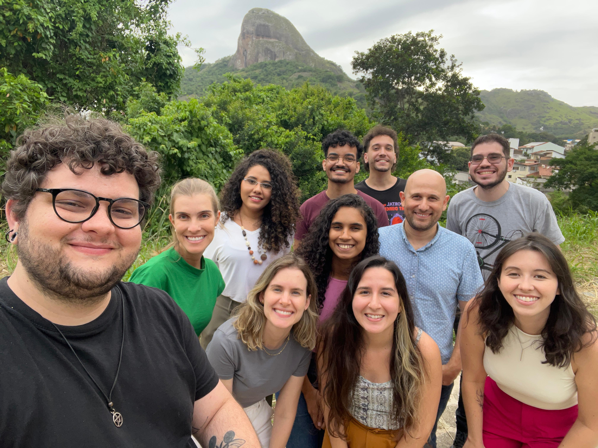

# The group

Meet the members of our research group, a dedicated team of scientists and experts committed to advancing our understanding of Immunology. 

 

Our diverse team brings together a wide range of expertise, from web-lab researchers to bioinformaticians. 

Currently, the IMMB-Lab is coordinated by Prof. Daniel Gomes.



 
Each member contributes unique skills and perspectives, fostering a collaborative environment focused on the discovery of new immunopathogenic aspects of infectious diseases. Discover more about our various members below! 

